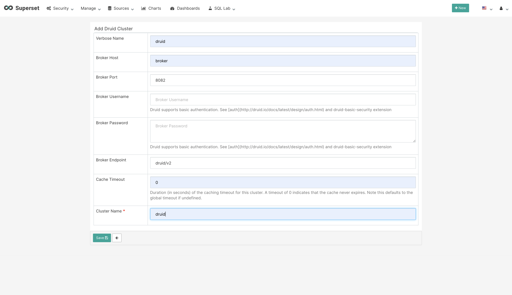
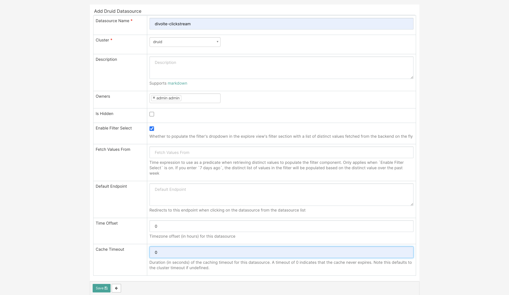
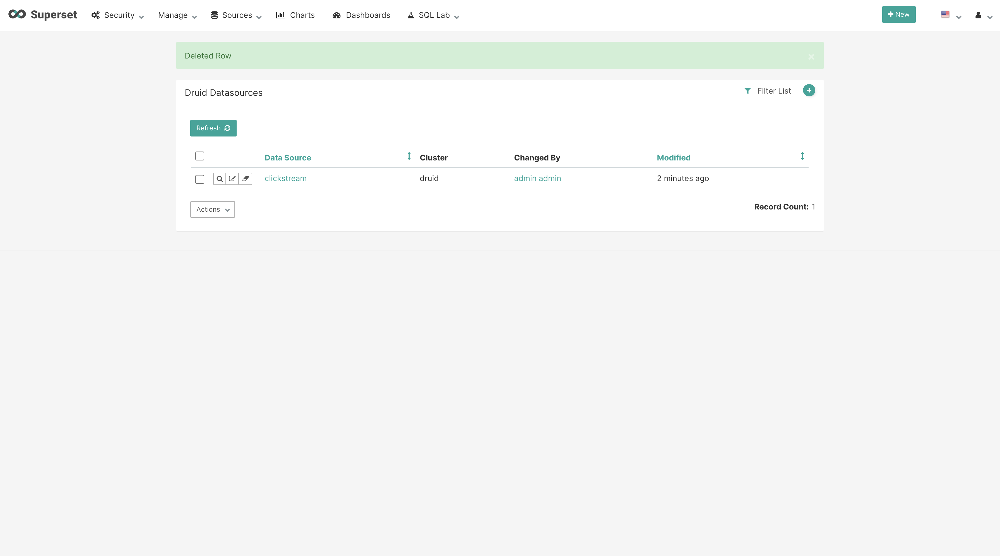
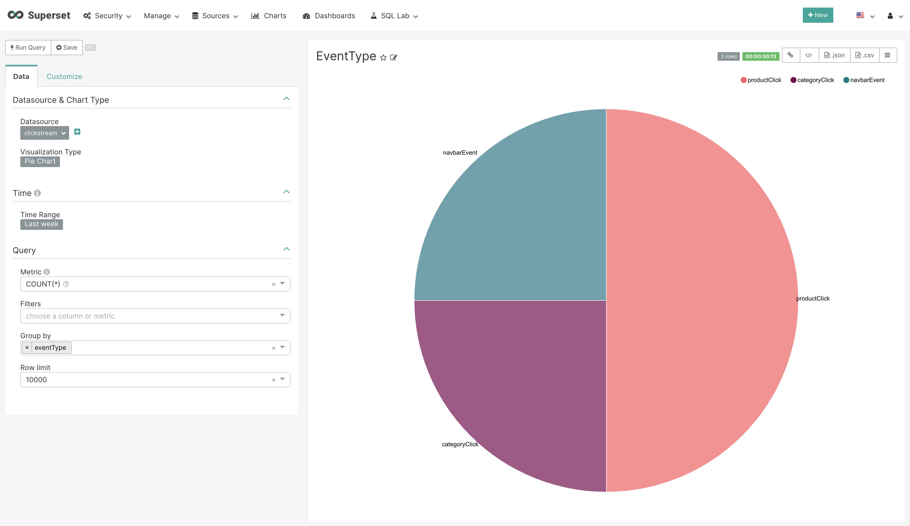

# DIVOLTE + KAFKA + DRUID + SUPERSET STACK
This stack could be alternative for Google Analytics. You can use this stack to store your own data on your server instead of third party vendors.

#### Workflow:

Divolte Collector captures event, parses data and sends them to the Apache Kafka. Then using the Apache Druid Kafka Indexing Service (KIS) writing data to the Druid. KIS is an extension for Druid that enables both real-time and historical data ingestion from Kafka topics with an "exactly-once" guarantee. Apache Superset is used for a monitorize data from druid.
## Getting Started
```
docker-compose build
docker-compose up -d
```

or 

```
docker-compose up -d
```
## Configurations
> These configurations are sample configuratons for this stack.
> You can change that with your own configurations. 

Where to find configuration files?

| Application | Configuration File | Description |
| ------ | ------ | ------ |
| Apache Druid | [druid/environment] | Druid common configuration file
| Apache Druid | [druid/supervisor-spec.json] | Kafka Indexing Service (KIS) configuration file
| Divolte | [divolte/DefaultEventRecord.avsc] | Divolte Avro Schema
| Divolte | [divolte/divolte-collector.conf] | Divolte configuration file
| Divolte | [divolte/mapping.groovy] | Divolte mapping file
| Apache Superset | [superset/superset_config.py] | Superset configuration file

## Druid Supervisor Configuration
#### Request
```
curl -X POST -H 'Content-Type: application/json' -d @./druid/supervisor-spec.json http://localhost:{{COORDINATOR_PORT}}/druid/indexer/v1/supervisor
```

#### Response
```
{"id":"clickstream"}
```

## Divolte Log Collector
The docker compose file includes Divolte Collector. So divolte.js file is already created. Add this code line to your html file where you want to use.
```
<script src="//localhost:{{DIVOLTE_PORT}}" async defer></script>
```
After that you can send events to the divolte using signal method.
```
divolte.signal('eventName', {eventParameter: eventParameterValue})
```

## Superset
Admin username and password can changed from the .env file. Default informations are below;

```
username: admin
password: superset
```

### Usage
1-) First click on the "Sources -> Druid Clusters" menu. Then "Add a new record" button. This is where we can define druid clusters.



2-) Click on the "Sources -> Druid Datasources" menu. Then "Add a new record" button. This is where we can define our datasources. You can add more than one datasources from here.



3-) Click on the "Sources -> Refresh Druid Metadata" menu. Then the page will be redirected to the datasources window. Click on your datasource and make your new chart for your dashboards.





## App
This is a sample application for understanding of how you can use this stack. It is not working on docker so just open the file in browser for use.

## Interfaces
> Ports are given as variables because of you can change the ports from.env file.

#### Druid Interface:

```
http://localhost:{{ROUTER_PORT}}
```

#### Divolte Interface:
```
http://localhost:{{ROUTER_PORT}}
```

#### Superset Interface:
```
http://localhost:{{ROUTER_PORT}}
```